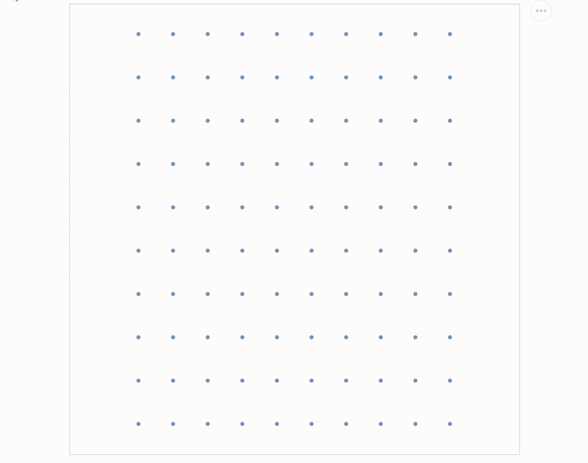
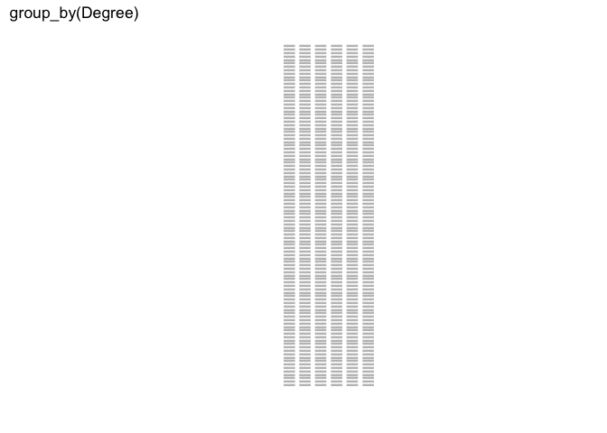

<!-- README.md is generated from README.Rmd. Please edit that file -->

```{r, include = FALSE}
# Global chunk options
knitr::opts_chunk$set(
  collapse = TRUE,
  comment = "#>",
  fig.path = "man/figures/README-",
  out.width = "80%",
  warning = FALSE,
  message = FALSE
)
  
# Specific options
knitr::opts_template$set(
  # Actually generating the datamations - don't show the code or results (returns FALSE right now), and cache the image so it's not regenerated each time
  datamations_generate = list(
    cache = TRUE,
    echo = FALSE,
    results = "hide"
  )
)

ggplot2::theme_set(ggplot2::theme_minimal())
```

# datamations

<!-- badges: start -->
[](https://github.com/jhofman/datamations/actions)
<!-- badges: end -->

datamations is a framework for automatic generation of explanation of plots and tables from analysis code. It automatically turns code into animations, showing the steps that led to a plot or a table.

## Installation

You can install datamations from GitHub with:

```r
# install.packages("devtools")
devtools::install_github("jhofman/datamations")
```

## Usage

To get started, load datamations and dplyr:

```{r load-libraries}
library(datamations)
library(dplyr)
```

### Plot-based datamations

A plot-based datamation shows a plot of what the data looks like at each step of a pipeline, animated by the transitions that lead to each state. The following shows an example taking the built-in `small_salary` data set, grouping by `Degree`, and calculating the mean `Salary`.

First, define the code for the pipeline, then generate the datamation with `datamation_sanddance()`:

```{r mean-salary-degree-plot-setup, eval = FALSE}
"small_salary %>% 
  group_by(Degree) %>%
  summarize(mean = mean(Salary))" %>%
  datamation_sanddance()
```

```{r mean-salary-degree-plot-datamations-gif, echo = FALSE}
knitr::include_graphics("man/figures/README-mean_salary_group_by_degree.gif")
```

You can group by multiple variables, as in this example, grouping by `Degree` and `Work` before calculating the mean `Salary`:

```{r mean-salary-degree-plot-work-setup, eval = FALSE}
"small_salary %>%
  group_by(Degree, Work) %>% 
  summarize(mean = mean(Salary))" %>%
  datamation_sanddance()
```

```{r mean-salary-degree-work-plot-datamations-gif, echo = FALSE}

```

datamations has some defaults in terms of how groups are represented. As seen in the above two examples, when there is one grouping variable, it's shown on the x-axis. When there are two grouping variables, the first (by what comes first in `group_by()`) is shown in column facets, and the second is shown on the x-axis as well as colored. If there are three grouping variables, the first is in column facets, the second in row facets, and the third on the x-axis and colored.

If you would like to change these defaults, or to match an existing plot style, datamations can take ggplot2 code as input.

For example, to match this plot, which has Work on the x-axis and Degree in row facets:

```{r ggplot2-existing-plot, dpi = 300}
library(ggplot2)

small_salary %>%
  group_by(Work, Degree) %>%
  summarize(mean_salary = mean(Salary)) %>%
  ggplot(aes(x = Work, y = mean_salary)) + 
  geom_point() + 
  facet_grid(rows = vars(Degree))
```

Simply define the code and pass to `datamation_sanddance()`, which will produce an animation with desired plot layout.

```{r mean-salary-degree-work-ggplot-setup, eval = FALSE}
"small_salary %>%
  group_by(Work, Degree) %>%
  summarize(mean_salary = mean(Salary)) %>%
  ggplot(aes(x = Work, y = mean_salary)) + 
  geom_point() + 
  facet_grid(rows = vars(Degree))" %>%
  datamation_sanddance()
```

```{r mean-salary-degree-work-ggplot-datamations-gif, echo = FALSE}
knitr::include_graphics("man/figures/README-mean_salary_group_by_degree_work_ggplot.gif")
```

When ggplot2 code is provided, the order of animation is not determined by the order in `group_by()`, but by the plot layout. Variables are first animated by what's in the column facets, then the row facets, by the x-axis, and finally by color.

Some limitations:

* `facet_wrap()` is not supported - please use `facet_grid()`
* datamations expects different variables in the column and row facets than in the x-axis. datamations generated that do not match this layout may look different than the final plot!
* Only `geom_point()` is supported, e.g. specifying `geom_bar()` will not produce a bar in the datamation.

### Table-based datamations

A table-based datamation shows a mock table of what the data looks like at each step of pipeline, again animated by the transitions that lead to each state. The following shows our same first example: taking the built-in `small_salary` data set, grouping by `Degree`, and calculating the mean `Salary`, using the same pipeline.

You can generate a table-based datamation with `datamation_tibble()`:

```{r mean-salary-degree-work-table-datamations, eval = FALSE}
datamation_tibble(
  pipeline = "small_salary %>% group_by(Degree) %>% summarize(mean = mean(Salary))",
  output = "mean_salary_group_by_degree.gif"
)
```

```{r mean-salary-degree-work-table-datamations-generate, opts.label = 'datamations_generate'}
# Excluding the titles for now - the title framework seems to be different between plots/tables so I'll dig into that later.
#   titles = c(
#     "Grouping by Degree and Work",
#     "Calculating the Mean of Each Group"
#   )

datamation_tibble(
  pipeline = "small_salary %>% group_by(Degree) %>% summarize(mean = mean(Salary))",
  output = here::here("man", "figures", "README-mean_salary_group_by_degree-table.gif")
)
```

```{r mean-salary-degree-work-table-datamations-gif, echo = FALSE}

```

Datamations work on any dataset provided, as in this example taking `mtcars` and grouping by `cyl`:

```{r mtcars-group-cyl-datamations, eval = FALSE}
mtcars_group_cyl <- "mtcars %>% group_by(cyl)"
datamation_tibble(mtcars_group_cyl, output = "mtcars_group_cyl.gif")
```

```{r mtcars-group-cyl-datamations-generate, opts.label = 'datamations_generate'}
datamation_tibble(
  pipeline = "mtcars %>% group_by(cyl)",
  output = here::here("man", "figures", "README-mtcars_group_cyl.gif")
)
```

```{r mtcars-group-cyl-datamations-gif, echo = FALSE}
knitr::include_graphics("man/figures/README-mtcars_group_cyl.gif")
```
