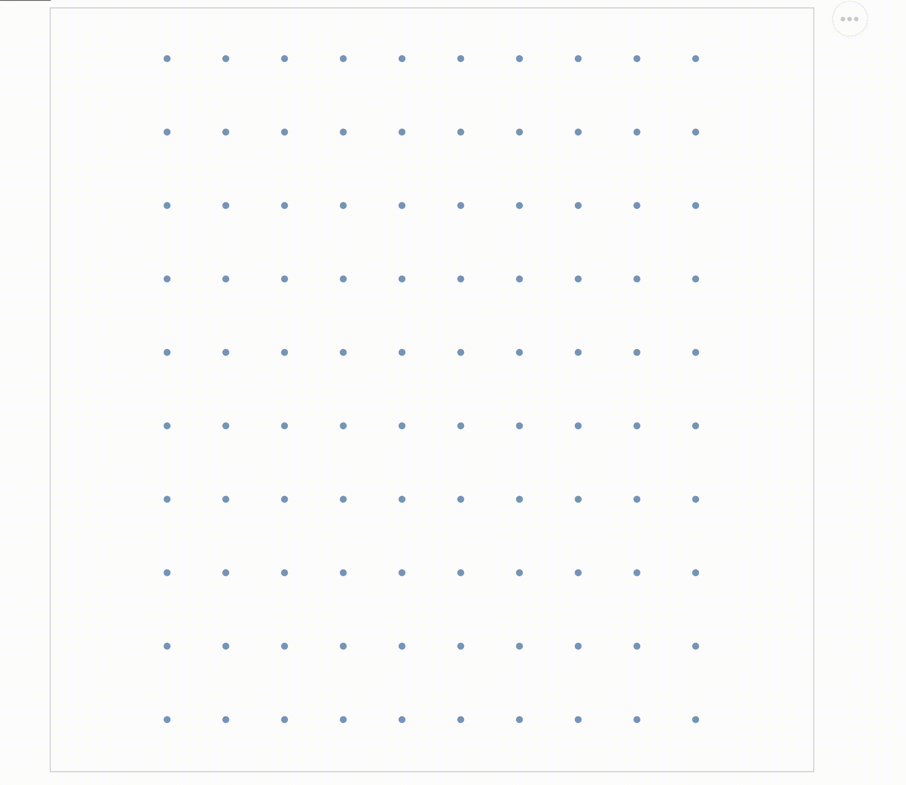

<!-- README.md is generated from README.Rmd. Please edit that file -->

```{r, include = FALSE}
# Global chunk options
knitr::opts_chunk$set(
  collapse = TRUE,
  comment = "#>",
  fig.path = "man/figures/README-",
  out.width = "80%",
  warning = FALSE,
  message = FALSE
)
  
# Specific options
knitr::opts_template$set(
  # Actually generating the datamations - don't show the code or results (returns FALSE right now), and cache the image so it's not regenerated each time
  datamations_generate = list(
    cache = TRUE,
    echo = FALSE,
    results = "hide"
  )
)
```

# datamations

<!-- badges: start -->
[](https://github.com/microsoft/datamations/actions)
<!-- badges: end -->

datamations is a framework for the automatic generation of explanation of the steps of an analysis pipeline. It automatically turns code into animations, showing the state of the data at each step of an analysis.

For more information, please visit the [package website](https://microsoft.github.io/datamations/), which includes [additional examples](https://microsoft.github.io/datamations/articles/Examples.html), [defaults and conventions](https://microsoft.github.io/datamations/articles/details.html), and more.

## Installation

You can install datamations from GitHub with:

```r
# install.packages("devtools")
devtools::install_github("microsoft/datamations")
```

## Usage

To get started, load datamations and dplyr:

```{r load-libraries, echo = FALSE}
library(datamations)
library(dplyr)
```

A datamation shows a plot of what the data looks like at each step of a tidyverse pipeline, animated by the transitions that lead to each state. The following shows an example taking the built-in `small_salary` data set, grouping by `Degree`, and calculating the mean `Salary`.

First, define the code for the pipeline, then generate the datamation with `datamation_sanddance()`:

```{r mean-salary-degree-plot-setup, eval = FALSE}
library(datamations)
library(dplyr)

"small_salary %>% 
  group_by(Degree) %>%
  summarize(mean = mean(Salary))" %>%
  datamation_sanddance()
```

```{r mean-salary-degree-plot-datamations-gif, echo = FALSE}

```

datamations supports the following `dplyr` functions:

* `group_by()` (up to three grouping variables)
* `summarize()`/`summarise()` (limited to summarizing one variable)
* `filter()`
* `count()`
